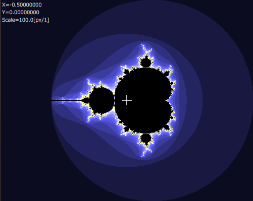
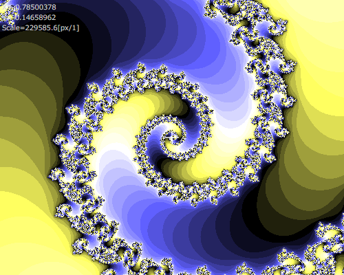
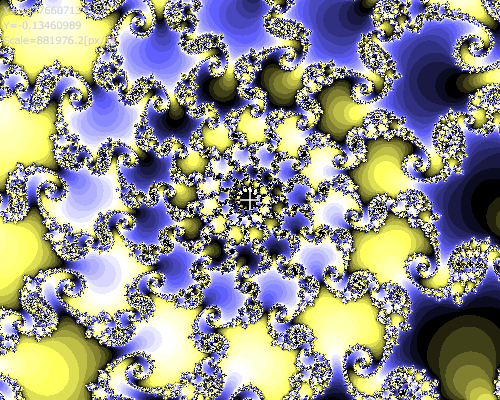
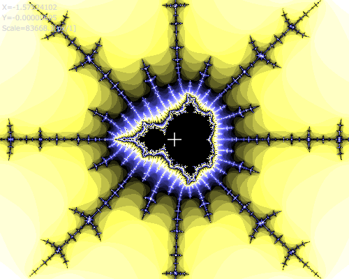

# Mandelbrot
The mandelbrot set viewer

ブラウザでマンデルブロ集合を表示するJavaScriptです。マウスやピンチイン・ピンチアウトで移動拡大表示が可能です。

# Demo
https://astroid-apps.github.io/mandelbrot/

# Sample

# Reference

WebGL Version (fastest rendering)

https://github.com/astroid-apps/mandelbrot-webgl

Multi Thread Version

https://github.com/astroid-apps/mandelbrot-multi-thread

# Link
https://en.wikipedia.org/wiki/Mandelbrot_set

https://ja.wikipedia.org/wiki/%E3%83%9E%E3%83%B3%E3%83%87%E3%83%AB%E3%83%96%E3%83%AD%E9%9B%86%E5%90%88

